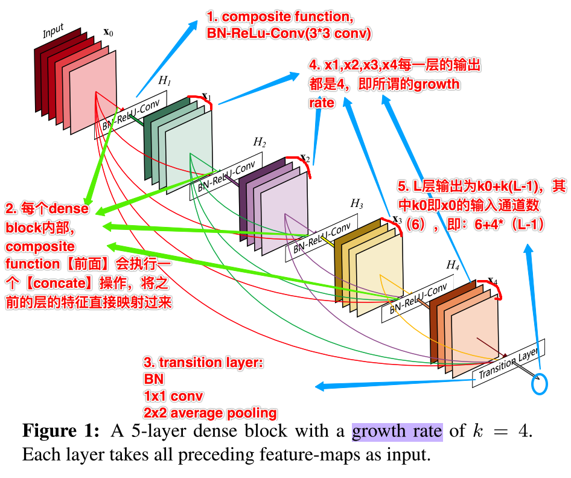
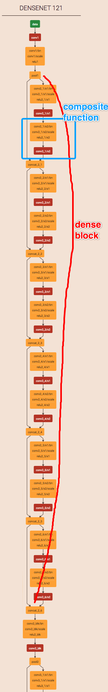
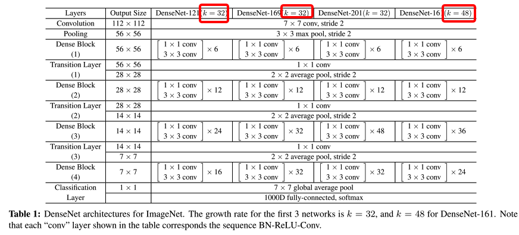
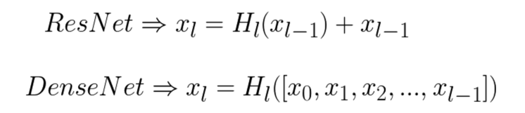
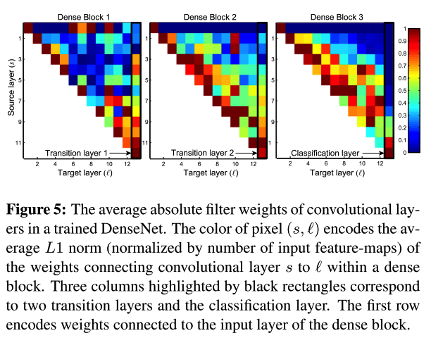

paper: [Densely Connected Convolutional Networks](http://openaccess.thecvf.com/content_cvpr_2017/papers/Huang_Densely_Connected_Convolutional_CVPR_2017_paper.pdf) CVPR2017 Best Paper Award

code: [https://github.com/liuzhuang13/DenseNet](https://github.com/liuzhuang13/DenseNet)

### 1. Abstract
1. DenseNet和ResNeXt都属于简单的易实现的小变动，带来accuracy的提升，同时不会增加computational cost. 而DenseNet开篇的简易图示，已清晰的展示其主要特征，如下图：
    

2. 由图中备注可以发现其主要的特点：
    * 同样引入一个复合单元（图中1. composite function），即BN-ReLu-Conv三个操作，其中conv是3x3，这里最后一个conv的filter个数，应该就是对应下面所属的growth rate
    * concatenate操作，在composite function前用concatenate操作，将当前层之前的所有层的特征全部reuse
        * 在没有增加计算参数的情况下，引入更丰富的特征
        * 由于是直接reuse前面层的特征，也会使得网络能够更容易训练
        * 作者在文中提出，这种dense connection也起到正则项的作用，防止在小样本上过拟合
        * 这里的concate是和ResNet中的element-wise的sum的一个主要区别之一，用sum的话，其实相当于在下一层引入了新的特征
    * transition layer
        * 有BN，1x1 conv，2x2 average pooling组成，主要是连接dense block之间。其中2x2的average pooling能实现对卷积网络的down-sample
    * growth rate && transition layer
        * 这里可以将其理解为composite function中最后的conv输出的channel个数（即k），因为是要执行concate操作，且作者保持了每个dense block内部的每层网络的输出个数一样，相当于concate后的channel维度的增长方式是以k为单位的，因此，最后的transtion层(第L层)输入的channel个数应该是k0+k(L-1)
        * 上面的*DenseNet示意图*中备注的*5*这点，对应的位置有问题，其就是指向transition层，因为在transition层之前执行的concate操作

3. DenseNet的网络结构示意图
    * 
    * 

### 2. Details
1. Dense connectivity
关于dense connectivity的介绍，从下面的公式很容易看出来：

    * 可见，其与ResNet的主要区别在于H的输入，ResNet将上一层特征直接通过identity map映射到下一层，取学习一个残差；DenseNet则是将**当前层之前的所有层concate后**作为当前层的输入

2. 其他的诸如transition layer，growth rate等前文已简述过

3. Bottleneck layers
    * DenseNet同样参考ResNet等网络中的bottleneck结构，降低网络的computational cost，即在3x3卷积之前增加1x1卷积，也就是在composite function前增加一个BN-ReLu-Conv操作（其中，conv是1x1的方式）

4. Compression
    * 同样为了减少参数，降低computational cost，作者对每个transition layer的feature map的个数m增加了变量因子（theta），最终transition layer传给下一层feature map的个数为theta\*m；
    作者实验中用的theta为0.5，通过在transition layer后增加一个1x1卷积实现

5. Feature reuse
    * 关于这部分，作者做了一个很有意思的实验，即统计每一层对其之前的所有层的特征的依赖程度，如下图：
        * 
    * 如作者文中所述，上图可知：
        * 每个dense block内部，所有层都多次传递其特征到其他层，也就是浅层特征也能被统一模块内的深层结构用到（ResNet的目的）
        * transition layer的权重同样有在其之前的dense block中传递，即网络的数据能通过某些间接方式从第一层传到最后一层
        * transition layer中含有很多冗余的信息，这一点和前面第四点compression结果吻合
        * 通过classifier的对比，可以看出在网络的后面一些层也产生了更高层的特征

---

资料
1. 知乎他人解读，里面的用的作者CVRP的slide图比较生动[https://zhuanlan.zhihu.com/p/37189203](https://zhuanlan.zhihu.com/p/37189203)