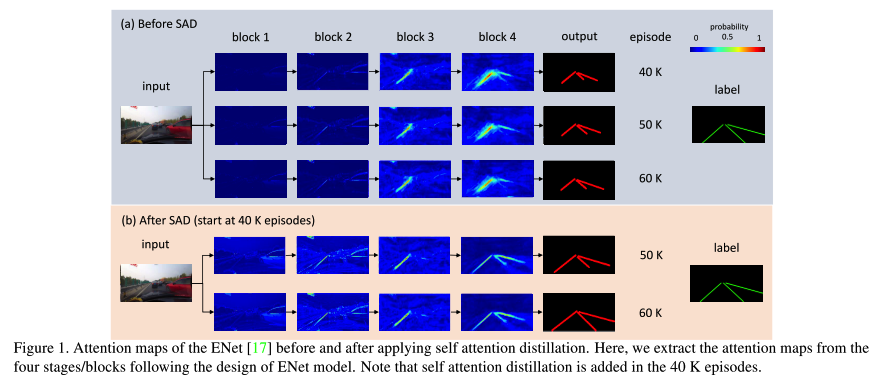
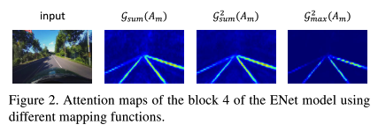
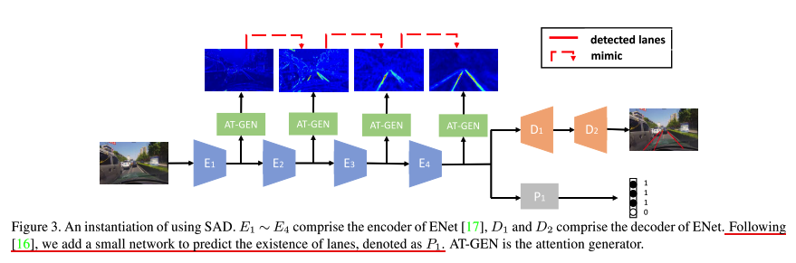
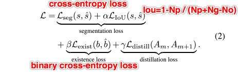
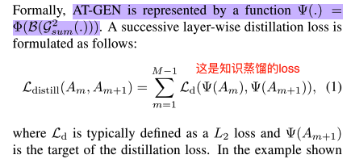
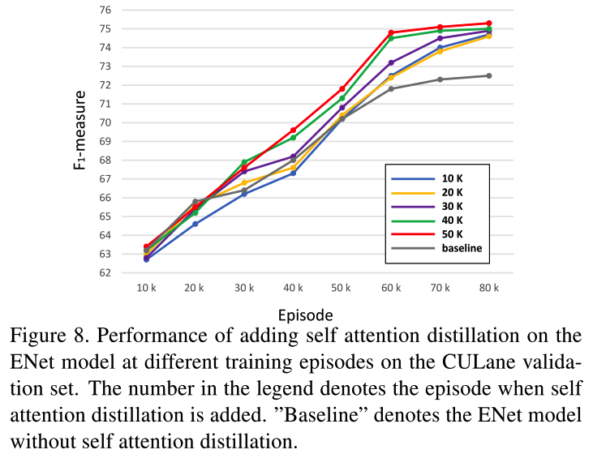

paper: [Learning Lightweight Lane Detection CNNs by Self Attention Distillation](https://arxiv.org/abs/1908.00821)

code: [https://github.com/cardwing/Codes-for-Lane-Detection](https://github.com/cardwing/Codes-for-Lane-Detection)

### Abstract
1. 本论文的思路比较清晰，想通过知识蒸馏的方式，用高层的信息来反哺优化低层学习到更准确的信息，而低层学习到的更准确的特征表达又能进一步帮助提升高层的特征表达；
2. 同时，作者们将SAD(Self Attention Distillation)设计成一个module，能够很容易嵌入到CNN网络中；
3. 将SAD嵌入到自己的网络中，只需要在训练阶段加入即可，因此不会给inference过程增加多余的参数

4. 其中SAD的特征图如下
    * 

### Details

1. SAD模块
    * 作者这里采用的是Activation-based Attention distillation(相较于gradient-based attention map)
    * 一个attention-map生成器的作用，就是学习一种映射函数，该函数能够功能：，其中M表示某一层
    * 显而易见，对于这样的映射函数，可以选择在channel维度求和、求最大值等方式，作者在为选用了平方和这一方式；同时对比了集中方式的影响，如下图
        * 

2. 添加SAD模块
    * 在ENet中添加SAD模块的一个实例展示如下：
        * 
        * 可见，这一加入，对原始网络结构不需要改动，只需要更新loss即可
    * Loss
        * 整体的loss极为各部分的组合；由于主任务是车道线检测，loss中引入了一个二分类的交叉熵loss，同时也增加了一个IoUloss，该loss能帮助增加预测结果和gt之间的重叠度，也即是能够将预测的宽度和实际宽度更相近，如下：
            * 
        * attention generator的loss如下：
            * 
    * 何时添加SAD模块
        * 作者对比了在不同的训练阶段增加SAD模块的影响：训练早期加入的话，由于网络本身还没学习到足够好的特征表示，因此会产生不够好的Attention Map，而在训练的后期加入，会明显提升特征表示，如下图；
            * 

3. 实验
    * 作者在三个公开数据集上进行实验，TuSimple，CULane，BDD100K，其具体的评判标准分别为：
        * TuSimple: 官方像素级别的accuracy，accuracy = Np / Ngt，即预测的像素点的所有值除以总的像素点数。同时，作者提供了FP和FN
        * CULane: 将线宽设为30像素，计算其和gt之间的IoU，IoU大于0.5的认为是TP，最终根据F1准则来评估。F1 = 2\*Precision\*Recal / (Precision+Recal)
        * BDD100K：用像素级的accuracy和IoU作为评估准则
    * trick
        * 将背景像素的cross-entropy loss的权重设置为0.4
        * 数据扩充中，使用来random rotation，random cropping，horizontal flipping（个人理解，后一个扩充方式的话，需要把label也同步更改了）
