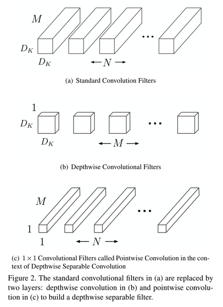
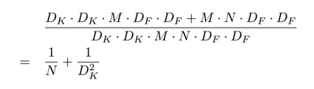
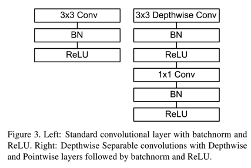
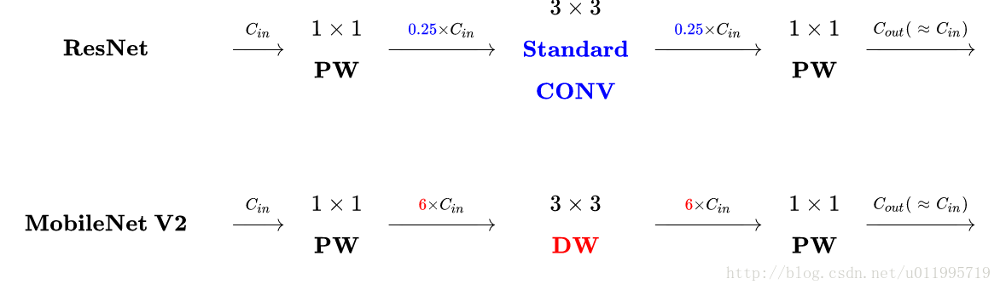
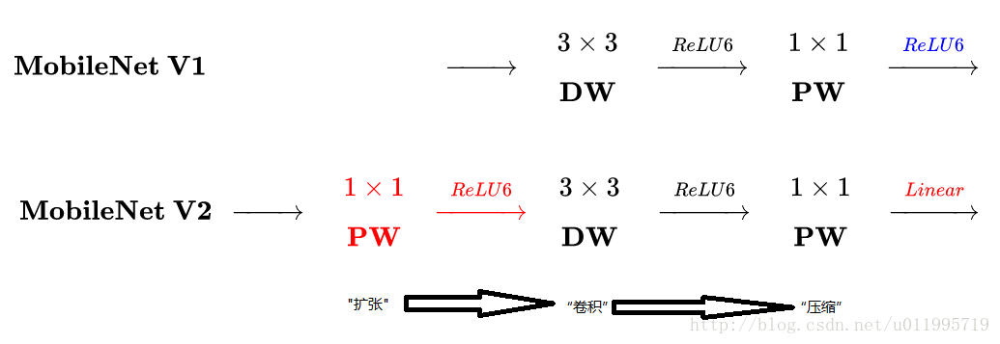
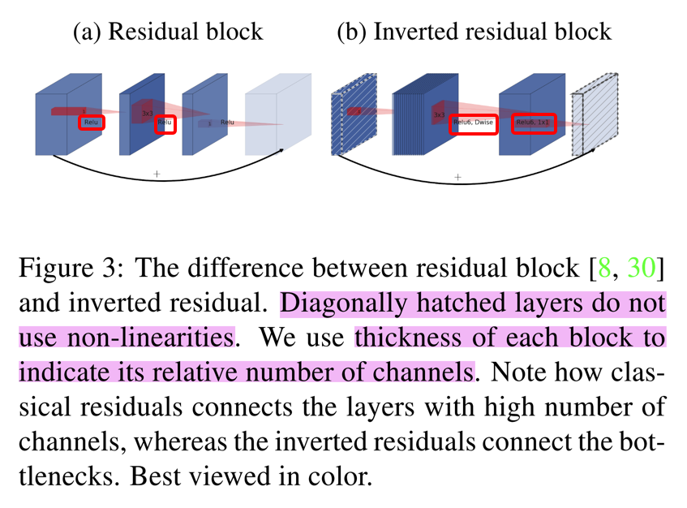
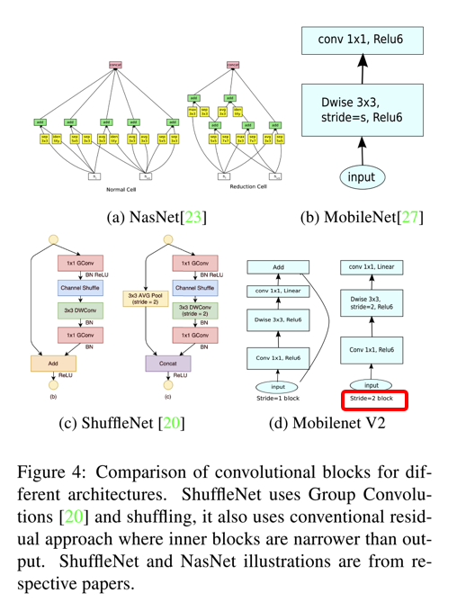

### MobileNetV1

由于是比较经典且早期的文章了，所以就直接记录一下其主要优化点了。

#### Details
1. 用depth-wise conv+point-wise conv替代传统的一个conv，以降低参数量
    * dw和pw conv的展示如图
        * 
    * 该方式对参数量的影响如下图：
        * 

2. dw conv和pw conv替换传统一个conv+BN+ReLU的方式
    * 如图

3. 作者们也引入了width multiplier和resolution multiplier对baseline的mobilenet进行调整

4. mobilenet提出的时间也是挺早的，所以只是直筒式的用dw conv和pw conv替换standard conv，但是没有任何的residual connection和bottleneck模块

### MobileNetV2

paper: [MobileNetV2: Inverted Residuals and Linear Bottlenecks](https://arxiv.org/abs/1801.04381)

#### Abstract
1. 如论文标题所述，直接的两个改进点就是"Inverted Residuals"和“Linear Bottlenecks”

2. 文中的理论分析比较多，没有很详细的理解，主要关注这两个改进点

#### Details

1. Inverted Residuals
    * 传统的Resnet的Residual结构，是在模块输入的地方，先用1x1卷积压缩channel个数，然后3x3卷积，最后在用1x1卷积扩展channel个数
    * Inverted Residuals则是与之相反，先用1x1 conv扩展channel个数，然后3x3卷积，最后再用1x1卷积压缩channel个数，对比如图（附图来源[MobileNetV2解读][MobileNetV2解读]）
        * 
        * 
    * 之所以如此做，mobilenet中如果用dwconv降低channel个数的话，经过ReLU转换，很多特征可能就已经无效了（抑制为0），导致后面即便把channel扩展起来，也会对结果产生影响

2. Linear Bottlenecks
    * 作者在文中分析了ReLU的非线性变化会对损坏部分特征，导致模块学习的特征表达能力减弱，因此，在inverted residual bottleneck结构中，扩展channel时不添加ReLU变换，如下图或者参考上面[MobileNetV2解读][MobileNetV2解读]：
        * 

3. MobileNetV2和其他网络的对比
    * 和目前主流的轻量级网络的对比如下图:
        * 
    * 对stride=2时，mobilenet结构是没有添加residual connection的

4. ReLU6
    * 对普通的ReLU的输出clip，即限制最大的输出值为6，而不是原始的无穷大。

[MobileNetV2解读]: https://blog.csdn.net/u011995719/article/details/79135818