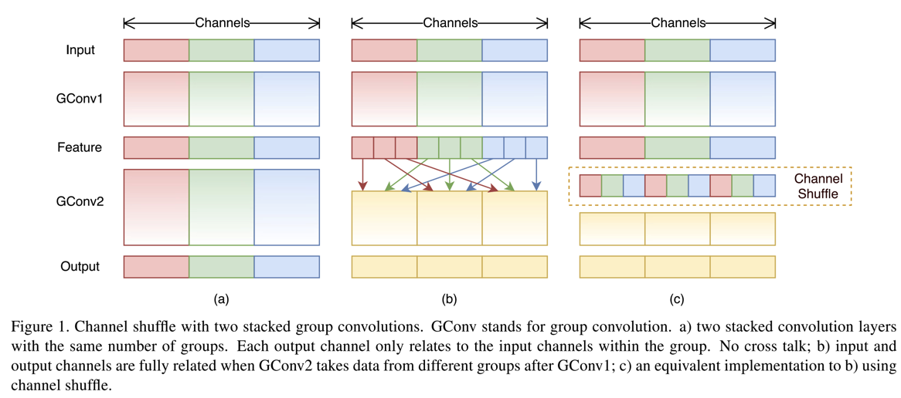
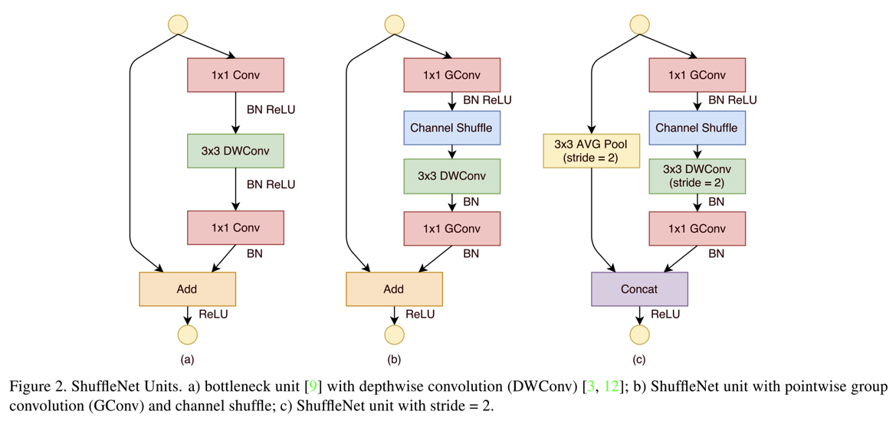
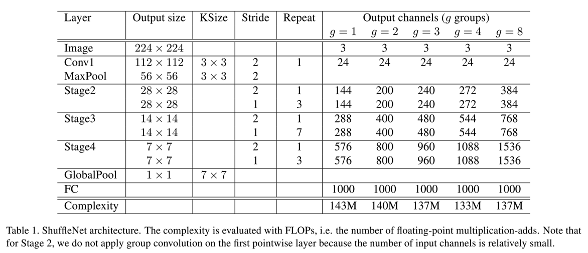
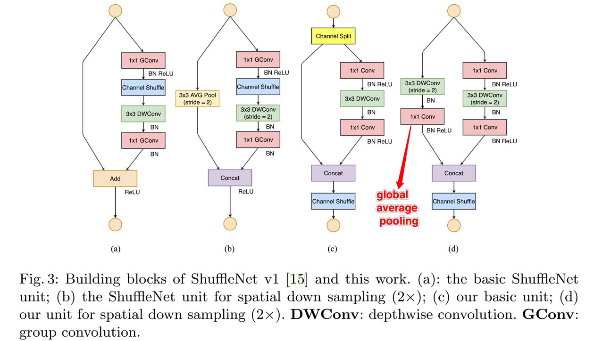
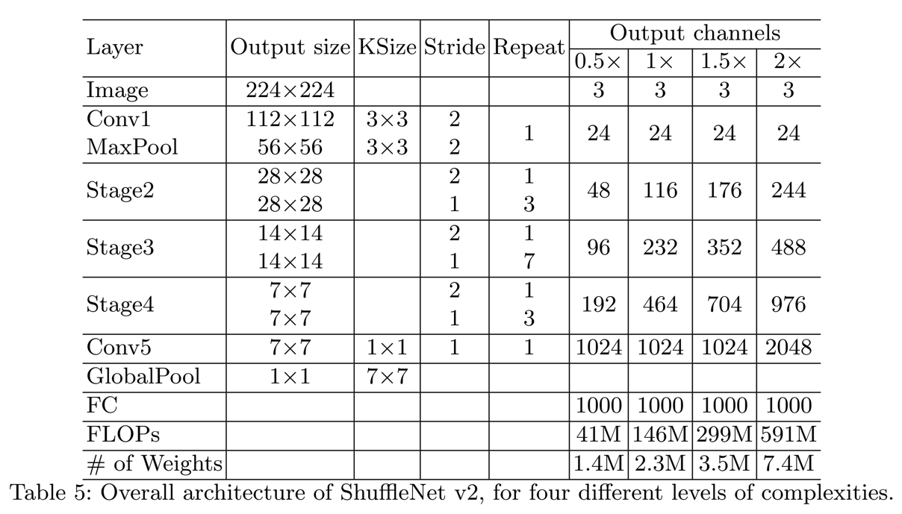

## ShuffleNet V1
paper: [ShuffleNet: An Extremely Efficient Convolutional Neural Network for Mobile Devices](https://arxiv.org/abs/1707.01083)

code: [https://github.com/farmingyard/ShuffleNet](https://github.com/farmingyard/ShuffleNet)
* 由于ShuffleNet只是增加了一个新的Shuffle层，这里的code是一个快速版本的caffe的shuffle层


### Abstract
1. 文章提出之时，很多网络结构，如Xception/ResNeXt等，由于大量的1\*1运算，使得在网络结构很小时并不高效；对此，作者用pointwise conv替代1\*1卷积，即用group conv将1\*1卷积拆分
    * 虽然ResNeXt中有cardinality维度，将channel分割成不同的组，但是并没有对一个ResNeXt模块内的所有层都执行分组，如ResNeXt中只对3\*3的卷积部分增加cardinality，则再传到下一层的话，就需要大量的add操作
    * 由此可知，一个shuffle unit中的所有层都将进行分组，如下图
        * 
2. 由于group conv使得前后层的特征只会在相同的group之间传递，没法相互促进；对此，作者提出Channel Shuffle操作

### Details
1. 如何实现Channel Shuffle？
    * 作者这里使用group conv操作实现该功能，如上代码就是caffe下的一个快速channel shuffle操作，主要就是这个拷贝操作
        ```C++
        template <typename Dtype>
        void ShuffleChannelLayer<Dtype>::Resize_cpu(Dtype *output, const Dtype *input, int group_row, int group_column, int len)
        {
            for (int i = 0; i < group_row; ++i) // 2
            {
                for(int j = 0; j < group_column ; ++j) // 3
                {
                    const Dtype* p_i = input + (i * group_column + j ) * len;
                    Dtype* p_o = output + (j * group_row + i ) * len;

                    caffe_copy(len, p_i, p_o);
                }
            }
        }
        ```
        * 注意p_i和p_o的顺序
    * ChannelShuffle操作在海思NNIE上暂不支持

2. 一个具体的ShuffleUnit结构？
    * 一个ShuffleUnit由1\*1的gconv，加上3\*3的DWconv，最后再加上一个1\*1的gconv组成，如下图
        * 
    * 图中C提供了一个改进版本的，增加了stride，同时也可以使得输出的channel个数增加不少

3. 一个ShuffleNet的整体结构？
    * 整体的ShuffleNet结构就是上述的ShuffleNet的堆砌，如下图：
        * 


## ShuffleNet V2

paper: [Shufflenet V2: Practical guidelines for efficient cnn architecture design](https://arxiv.org/abs/1807.11164)

* 相比于V1，V2并没有增加新的操作，因此可以沿用V1的代码

### Abstract
1. 如V2的文章名所述，其结合实际应用给出了一份实战准则，同时有根据该准则重构了V1版本的网络结构
2. 还有一个可以借鉴之处，是其对不同准则的分析实验方式，如MAC等（memory access cost）

### Details
1. 四大实践准则
    * use balanced-conv(equally channel width)，即尽可能保证输入输出的channel维度一样
    * be aware of the cost of group conv: group conv在网络经常使用，也能够带来FLOPs的减少，但是同样也增加了MAC
    * reduce the degree of fragmentation: 即减少网络中比较小的操作，因为这些会导致数据并行能力降低
    * reduce element-wise operation: 尽管element-wise的参数量比较小，但是MAX同样比较大

2. V2的一个ShuffleUnit结构
    * 
    * 对比图中的c，最基础的V2是先把channel split，一部分直接按照residual的方式identity map到下一阶段，另一部分执行类似与V1的操作，只不过不再在内部进行channel shuffle的操作，同时1\*1的gconv也改回conv了，且在DWConv后移除了ReLU操作
    * 图d，则是stride=2的情况。注意，这里在模块的开始处，没有进行channel split，这样能保证在下一届阶段channel的个数是double了

3. V2的整体网络结构
    * 