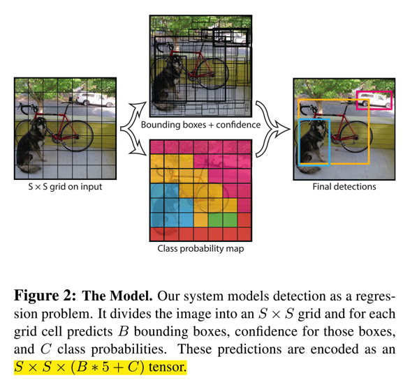
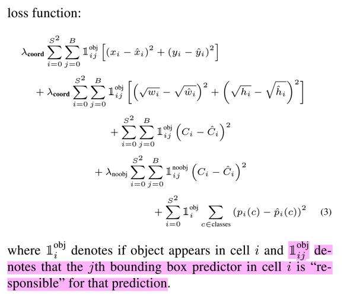
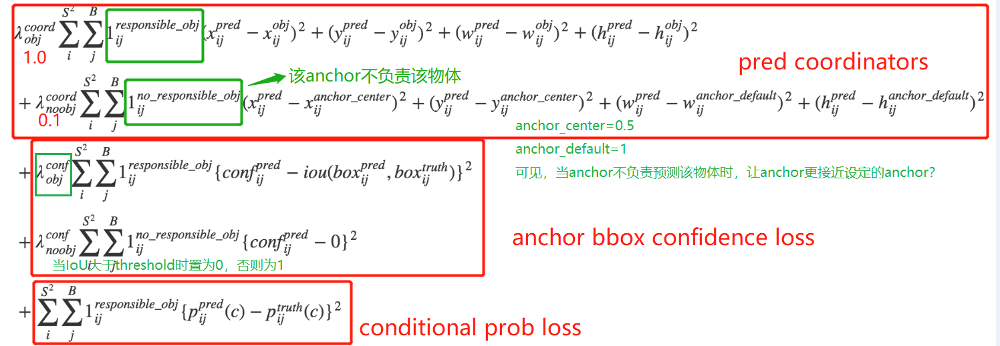

## Yolo V1
paper: [You Only Look Once: Unified, Real-Time Object Detection](http://arxiv.org/abs/1506.02640)

slide：[官方slide介绍，很详细](https://docs.google.com/presentation/d/1aeRvtKG21KHdD5lg6Hgyhx5rPq_ZOsGjG5rJ1HP7BbA/pub?start=false&loop=false&delayms=3000&slide=id.p)

### Abstract
1. 如文章名字所述，其完成一次目标检测，只需要look once，也就是不像两阶段的网络那样，也不像SSD那样，需要提前生成anchor bbox/default bbox
2. 网络计算特别快，主要是因为需要搜索的目标框的个数不多，如文中所述，对于7x7的cell，每个cell预测2个bbox，最终的总共框的个数也就98个，相对于SSD或Faster RCNN这些，少了很多。网络的模型如下图：
    * 


### Details
1. 原理
    * yolo v1是用CNN直接回归出目标的bbox，不需要生成anchor bbox
    * 对于一张图，将其分为SxS个cell，每个cell预测B个bbox，每个bbox携带[x,y,w,h,confidence]五个信息，同时网络还预测输出该bbox属于C类的概率（对于VOC，S是7，B是2，C是20）
        * 这里所说的*SxS个cell，每个cell预测B个bbox*，并不是对图像的真实操作，而是以网络的输出来体现的，即最后一层网络输出`7x7x(5x2+30)`维的数据。
            * 这一点有点抽象，对于网络最后的输出，前10个为第一个cell的值，而其体现是第一个cell的方式可以这样解读：在训练计算loss时，因为是认为网络输出的坐标值是和cell编码的（见下一条阐述），所以，训练样本的label就需要*映射*到对应的cell中，然后再去和网络输出计算loss，这样如果输出值和映射后的label相差较大，也就是loss会大，相对于惩罚越大，接下来迭代时就会偏向于预测的值和映射后的gt更相近的地方。
        * x和y是相对于每个cell编码的偏移，w和h是相对于原始图像编码的，confidence是当前cell存在目标与否的概率P与bbox和gt的IoU的乘积，即如果cell没有目标，则P=0，confidence=0，如果有目标，则P=1，confidence=IoU
        * 目标概率，相对于只和有目标存在的cell有关。**而且，每个cell不管预测多少个bbox，都是只预测一组C类的概率**，也就是为什么每个cell的输出是`5x2+20`，因为属于20个目标类别的概率是依赖于cell，而独立于bbox的

2. loss函数
    * 网络的loss是回归的loss和分类的loss的加权组合，由于一张图中大部分cell都是没有目标的，所以如果回归的loss和分类的loss等价的话，会导致不含有目标的cell的分类loss占据主导，不利于模型的稳定性，因此，引入两个权重因子，回归的loss权重为5，**没有目标的分类的loss**权重为0.5，而含有目标的cell的分类loss权重依然为1
    * 同时，w和h是开方之后计算的，以消除大尺寸框和小尺寸框的差异；如果不开方，则loss会趋向于拟合大尺寸的框
    * 对于回归的loss，只有该bbox属于该gt时才会计算（见loss函数的前两项）
    * 对于分类的loss，只有该cell存在bbox时才会计算（见loss函数的最后一项），同时该loss是IoU和条件概率P的乘积，且不会在B个bbox上叠加，因为一个cell只预测一组置信度得分
    * 

3. 如何准备数据标签？如何训练？
    * 训练数据是VOC的数据格式，只是在计算loss时会做编码处理
    * 网络结构如下图
        * 
    * 训练时原模型是ImageNet是预训练，然后增加多个`1x1`的卷积层，并将尺寸扩大到`448x448`

4. 测试时的网络输出是什么？
    * 每张图输出98个bbox，网络的最后两层是FC，然后reshape到`7x7x30`，依次存储的是每个cell的[x,y,w,h,c]，最后的20位是分类的概率信息
    * 对于网络中，一个较大的物体，可能会被多个cell预测出来多个框的情况，用NMS过滤
        * 获取第一类预测的98个bbox，如果得分小于阈值，直接将其得分置0
        * 然后对所有框的得分进行排序
        * 再进行nms过滤，即先取该类别置信度得分最高的bbox，然后将其他所有框与之计算IoU，IoU大于阈值，则置信度得分置0
        * 对所有的类重复这个过程，这样，每个bbox的20个类别的置信度得分中，会有很多被置为0了
        * 然后对每个bbox，取20个类别得分中最高的，作为其对应的预测类别
        * 参见slide的36至70页
    * 前向计算时，使用物体的类别预测最大值p乘以预测框的最大值c，即将类别预测值和IoU相乘，作为输出预测物体的置信度，这样能够尽可能适配到多个比例的目标，同时能够过滤到不少重叠的框（因为有IoU），见上面参考slide的第25页

5. 缺点？
    * 对于密集的目标、小目标不好
    * 对于新的长宽比的目标效果不好（SSD这些有anchor bbox，能够覆盖更多不同类型的目标）

6. 与SSD的区别
    * 采样方式不同：SSD是密集采样，需要预先设定多个anchor box，而yolo v1没有；SSD是用多个层的特征预测，yolo只用最后一层；SSD中每一层会设置响应的anchor的比例，yolo因为没有prior box，所以不需要设置
    * 预测框的编码方式不同：SSD是center size的方式，将prior box的坐标和gt的坐标编码到一起，同时加上了variance系数，详情见SSD文章；而yolo v1的偏移是相对于cell的，宽高是相对于原图的
    * loss的方式不同：SSD的loss分为分类loss（softmax loss）和回归loss（smooth l1），且只计算匹配到的prior box；yolo中分类loss和回归loss全部是l2loss，没有物体落入cell时，只计算该cell的分类loss，有物体时，计算其分类loss，两个框都会计算confidence loss，而只有IoU最大的那个才计算回归loss（即对当前cell responsible的bbox）
    * 网络最后输出的方式不同：SSD是loc(`4xKxMxN`)和confidence(`CxKxMxN`)作为两个分支分别输出，而yolo v1是融合到一起了，即最后的输出reshape到`30(5x2+20)`个`SxS`的FM，对于每个位置，包括两个框的坐标和confidence，同时包括该cell的conditional class probabilities

## Yolo V2
paper: [YOLO9000: Better, faster, stronger](https://arxiv.org/abs/1612.08242)

### Abstract
1. YOLO9000是在yolo的基础上引入BN, anchor box, passthrough, high resolution classifier/detector, multi-scale等改变来提升目标检测的性能的，构造的模型为Darknet-19，共有19个卷积层。
2. 如论文名字所示，改变主要有三点Better/faster/stronger，其中前两者主要的改变在网络结构和训练技巧上。

### Details

#### 网络结构
1. 增加BN层: Better
    * yolov2中，在每一个conv后面都添加BN层，mAP提升了2%（加入BN后，将v1中的dropout移除了）
2. High resolution classifier: Better
    * v2中直接先将分类网络在`448x448`的分辨率上训练，然后再放到detection任务上微调（v1中，先在`224x224`的图像上训练，再在`448x448`的图像上微调）
3. Multi-scale train: Better
    * v2在训练中尝试使用不同大小的图像进行训练，以cover更多不同scale的图像输入。（因为v2中移除了fc层，所以可以对输入图像进行resize）
    * yolov2的网络最后的图像缩放比例是32，作者选择的图像尺寸范围为320到608之间。在训练时，每隔10个batch，随机选择一个新的图像尺寸
4. Fine-grained feature: Better
    * 类似于residual connection的方式，yolo v2将最后输出的fm的前面更高分辨率的特征图加入进来以增加网络特征的尺度（网络输出是`13x13`，将前面`26x26`的fm结合过来）
    * 但是其实现方式不同，这里是一个reorganization层，是一个根据stride进行采样的方式，即将一个大的feature map变成小的feature map，如参考[yolov2 解读]
5. **Convolution with anchor box: Better**
    * 由于v1每次只预测98个bbox，当图像中物体相对较密集、物体的形状不同于常见形状等场景中效果不佳，因此v2把anchor box也引入进来了
    * 为了使用anchor box，作者将网络做了如下的改变：
        * 移除fc层，全部替换为conv层
        * 移除一个pooling层，将网络最后的预测大小能够在更高的分辨率上
        * 将输入图像从`448x448`缩小为`416x416`，以保证最后的feature map只有一个奇数中心点（因为网络是缩小32倍，前者最后的特征图是`14x14`，后者是`13x13`）
    * 不同于Faster Rcnn中对anchor box的使用方式，yolo v2依旧使用v1中对框的预测方式，将类型预测和位置回归解耦合，而不是对每个anchor box去预测其对应的的class和bbox
6. YoloV2中的anchor box
    * 如v1，v2将fm分成`MxM`的cell，每个cell也预测B个bbox（v2中是`13x13`的cell，每个cell预测5个不同aspect ratio的bbox）
    * 每个bbox包含4个坐标值（xywh，xy是相对于每个cell的，wh是相对于anchor box的w和h，也就是作者说的**Directly location prediction**），1个confidence score（该cell包含物体的概率），20个类别得分。而一个cell预测5个bbox，因此输出维度为125
    * anchor如何打标签的呢？
        * 得到物体的bbox的中心点，将这个中心点所落在的cell中的5个anchor box，与这个物体的bbox计算IoU，最大的anchor用于预测该物体（v1中每个cell只预测一组类别得分，即每个cell只负责预测一个物体）
    * **anchor的选择**
        * 不同于其他anchor的方法，yolov2中anchor是通过聚类的方式设计出一组anchor的，比例为
            ```
            // 宽和高，作者文中阐述了，选择的anchor多是高瘦的bbox
            [0.57273, 0.677385], 
            [1.87446, 2.06253],
            [3.33843, 5.47434],
            [7.88282, 3.52778],
            [9.77052, 9.16828].
            ```
        * 在聚类时，没有使用传统的欧氏距离loss，而是用的IoU loss
    * *预测的过程*：假设网络输出的预测结果是$(t_x, t_y, t_w, t_h, t_o)$, 每个cell相对于图像左上角的距离为$(c_x, c_y)$，anchor box(paper中的prior box)的宽高为$p_w, p_h$，则实际对应的结果为：
        \\[ d_x = \sigma(t_x) + c_x,
            d_y = \sigma(t_y) + c_y,
            d_w = p{_w}e^{t_w}
            d_h = p{_h}e^{t_h}
            P(object) * IoU(b, object) = t_o \\]
        * 其中，$\sigma$代表sigmoid函数，为了将某些结果压缩到0到1之间
        * 预测框的中心点$d_x, d_y$，压缩到0到1之间，加上对应的cell的中心点，宽和高$d_w, d_y$，其中e相当于缩放因子再乘以anchor的宽高
        * 除此之外，box的置信度和box的类别概率也是在0到1之间
        * 得到的$d_x, d_y, d_w, d_h$是相对于cell的，因此还需要再乘以缩放倍数32，才能得到在原图上的目标的框
    * 如作者文中所述，引入anchor，yolov2的mAP从69.5降低到了69.2，但是recall从81%提升到了88%
            
7. Loss
    * loss较为复杂，且论文中并没有给出，下面的loss附图，来源于[yolov2 解读2]
        * 

8. Yolov2的网络结构见[yolov2 网络结构] 
    * Darknet19，总计19个卷积层，5个maxpooling层，当用于detection时，移除最后一个conv，加上三个1024个3x3kernel的conv，最后再加一个125个1x1kernel的conv(加上linear activation)；同时，加入前面讲的reorg层
    * 可见，最后的输出是$13x13x125$，其中125便是代表每个cell预测5个bbox，每个bbox有4个coord、1个confidence、20个目标类别（不包含背景的）

9. 本文中还引入一个利用层级分类方法实现的更强的YOLO9000，这里不做详细阐述了


### reference
1. [yolov2](https://towardsdatascience.com/training-object-detection-yolov2-from-scratch-using-cyclic-learning-rates-b3364f7e4755)

[yolov2 解读]: https://towardsdatascience.com/training-object-detection-yolov2-from-scratch-using-cyclic-learning-rates-b3364f7e4755
[yolov2 解读2]: https://github.com/leetenki/YOLOv2/blob/master/YOLOv2.md
[yolov2 网络结构]: http://ethereon.github.io/netscope/#/gist/d08a41711e48cf111e330827b1279c31