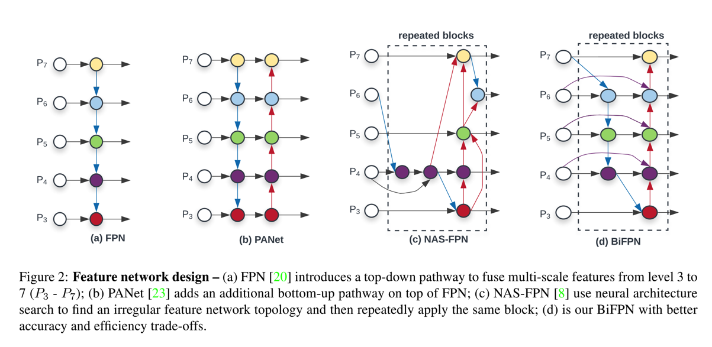
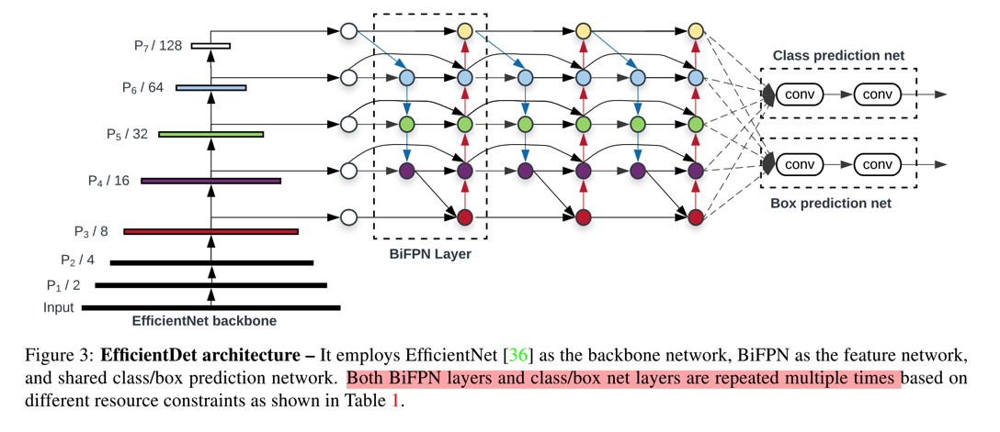

paper: [EfficientDet: Scalable and Efficient Object Detection](https://arxiv.org/abs/1911.09070)

code
* [官方tf](https://github.com/google/automl/tree/master/efficientdet)
* [民间PyTroch](https://github.com/zylo117/Yet-Another-EfficientDet-Pytorch)

### Abstract
1. 谷歌大脑团队提出的新的目标检测算法，性能极佳，EfficientDet-D0的mAP就超过了yolov3，EfficientDet-D6更是达到了50.9，且参数量更少。（D-X，其中X代表文中提到的scale factor）

2. EfficientDet的关键部分在于EfficientNet、BiFPN、Compound scaling method
    * 借鉴Efficient，将其作为网络的backbone
    * 对于特征融合，提出BiFPN的特征融合方式，在融合top-down和bottom-up的特征时，为不同的层分配不同的权重，并给出了fast normalized fusion的方式
    * 为了保持accuracy和efficiency之间的trade-off，引入compound scaling method，即引入一个因子，该因子会backbone的结构、BiFPN的结构以及最后的class/bbox子网络结构的维度统一进行调整，具体的实现方式则是给定候选的多个因子值，然后利用grid search，选取其中效果最优的。

3. 下文分析将主要集中在BiFPN上，EfficientNet参见[EfficientNet简介][EfficientNet简介]

### Details
1. BiFPN结构
    * 在RetinaNet中，网络结合FPN，将top-down和bottom-up的特征融合起来，其融合的方式是（以层P2为例），在bottom-up中有P2_bottom，在top-down中，有P2的上一层特征P3_up，然后将P3_up进行upsample使其维度和P2_bottom保持一致（可以用stride conv实现），同时对P2_bottom的channel进行降维（横向连接），使其channel和P3_up后的输出channel保持一致，然后进行element-wise的addition
    * 相较于FPN的方式，BiFPN则是增加了双向选择的方式，如下图：
        * 
        * 即，对于P6层最终的输出特征，有三部分构成：最原始的P6层特征（通过1x1的conv），P6层（1x1的conv）和P7层upsample后的特征融合的特征，P5层的最终的输出的特征（downsample），这里用的conv和padding都是same padding的方式，参考PyTorch中的代码实现如下
            ~~~Python
            p6_w1 = self.p6_w1_relu(self.p6_w1)
            weight = p6_w1 / (torch.sum(p6_w1, dim=0) + self.epsilon)
            # Connections for P6_0 and P7_0 to P6_1 respectively
            p6_up = self.conv6_up(self.swish(weight[0] * p6_in + weight[1] * self.p6_upsample(p7_in)))

            # Weights for P6_0, P6_1 and P5_2 to P6_2
            p6_w2 = self.p6_w2_relu(self.p6_w2)
            weight = p6_w2 / (torch.sum(p6_w2, dim=0) + self.epsilon)
            # Connections for P6_0, P6_1 and P5_2 to P6_2 respectively
            p6_out = self.conv6_down(
            self.swish(weight[0] * p6_in + weight[1] * p6_up + weight[2] * self.p6_downsample(p5_out)))
            ~~~
        * 用于特征融合的conv，如上面的`conv6_up`均是采用depthwise conv实现的

2. fusion的实现方式
    * 作者在文中给出了三种融合方式的介绍，这里只介绍最快速有效的fast normalized fusion的方式，公式如下：
        \\[ O = \sum_{i} \frac{e^{w_i}}{\epsilon + \sum_{j} {w_j}} \\]
    * 这个里面没有任何的softmax操作，相对更快速，如上面的代码所示
    * 其中的swish激活函数是\\( f = x \times sigmoid(x) \\)

3. class/bbox子网络
    * class和bbox的分类子网络和RetinaNet中的一样，分别是几个连续的conv操作（depthwise conv）最后分别输出对应的类别信息和bbox信息
    * 最终的网络结构图：
        * 

### Conclusion
1. 对于detection任务，特征融合对效果的提升应该是比较明显的，尤其是对小目标的检测，这是最简单粗暴的方式（其他还有，扩大输入图像的分辨率，数据增强，小目标的oversampling等）
2. 在算力资源的限制没有那么大后，现在NAS的应用范围越来越广了，也确实有效。RegNet甚至都已经开始对搜索空间下手了，值得了解一下。但在嵌入式设备上，还是比较受限制的。

---

[EfficientNet简介]: ../posts/22020-04-11-EfficientNet.md