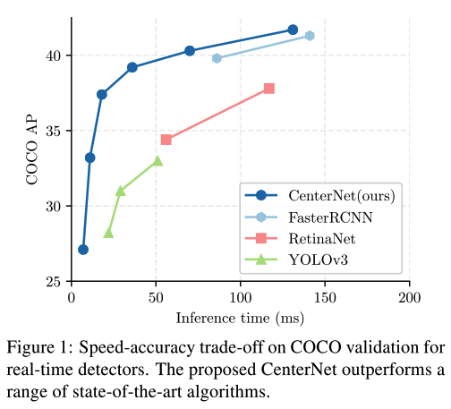
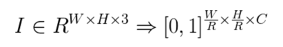
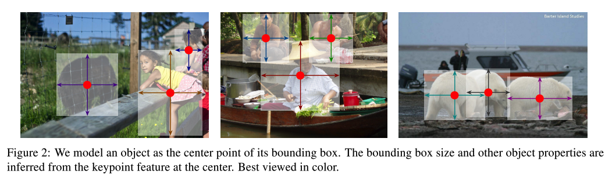
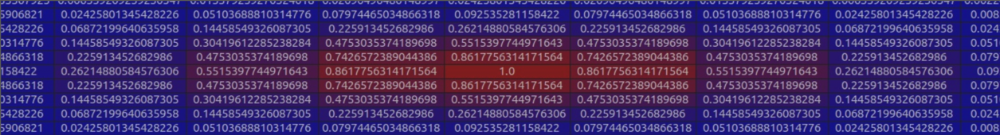
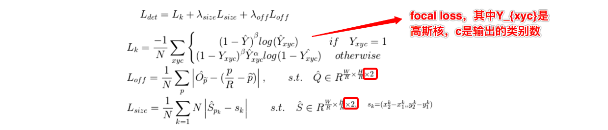
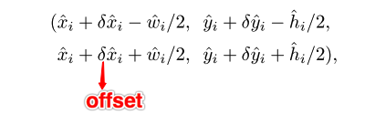

paper: [Objects as Points](http://arxiv.org/abs/1904.07850)

code: [https://github.com/xingyizhou/CenterNet](https://github.com/xingyizhou/CenterNet)

### Abstract
1. CenterNet是anchor-free的目标检测方法，用预测出的点表示一个object，同时回归出目标的size和offset。其性能表现如下：
    * 

2. CenterNet与one-stage和two-stage的detector的区别
    * 只预测目标的中心点，不需要设计anchor，也就无需构造positive samples和negative samples，耗时少且易于训练；
    * 不再需要NMS操作（这一点其实有些场景还是需要的，后续讲到）

3. CenterNet的主要建模思想
CenterNet的主要建模思想，可以参考如下公式和图示：
    * 
    * 
即对于一张输入的图像，CenterNet希望能够学到一个缩小**R**倍的heatmap，heatmap中每一个点的值若为1，则表示当前点检测到了类别为c的目标，为0则表示该点为背景；该方法，用目标框的中心点表示一个object，然后给出该object的size以及映射回原始图像的offset。

### Details
1. 训练时如何生成对应的heatmap
    * 对原始图像中一个单独的gt中心点，映射到缩小**R**倍的特征图上，这里是向下取整；
    * 用高斯核将*所有*gt中心点构造在一个原始图像缩小**R**倍的heatmap上
    * 用公式表示如下：
        * 
    * 9x9的效果图如下（附图来源参考链接1）：
        * 

2. Loss function
    * loss由三部分组成，heatmap中中心点相关的loss（focal loss），目标size相关的loss（L1 loss），以及目标offset相关的loss（L1 loss），如下图：
        * 
    
3. 如何将bbox转换为point？
    * 这一点和loss function中的size相关的的s_k的取值方式相似，即给定object的bbox是(x1,y1,x2,y2),则其中心点是((x1+x2)/2, (y1+y2)/2)
    * 这样的话，训练时对于数据只需要按照coco的方式处理好即可，不需要自己单独取整理计算出中心点作为输入

4. 如何将point转为bbox？
    * 对于网络inference阶段的结果，对每个类别的heatmap，取每个8邻域中的最大值，保留topK个（文中为100，不同任务可以调整），然后利用如下公式将点映射为bbox（如果需要映射回原图，还需要在下面公式的基础上乘以缩放系数**R**）：
        * 
    * 所有的输出都是直接用关键点预测的，不需要基于IoU的NMS操作

5. 不足之处
    * 毫无疑问，CenterNet能够减少anchor所需要的计算耗时，但同时其也有不足，即假如两个目标的中心点很靠近的话，会导致其中一个目标被忽略掉，因为在选取中心点时，是取8邻域的最大值，如此便把很靠近最大值的次大值忽略掉了

6. 源码解读
    * 暂时没详细的跟读源码

---
1. [https://zhuanlan.zhihu.com/p/66048276](https://zhuanlan.zhihu.com/p/66048276)