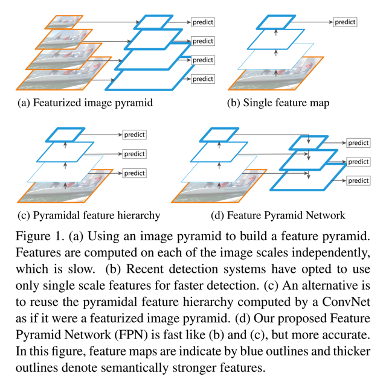
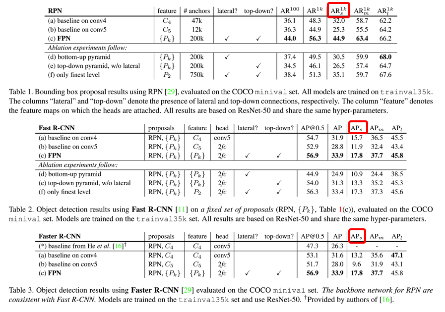
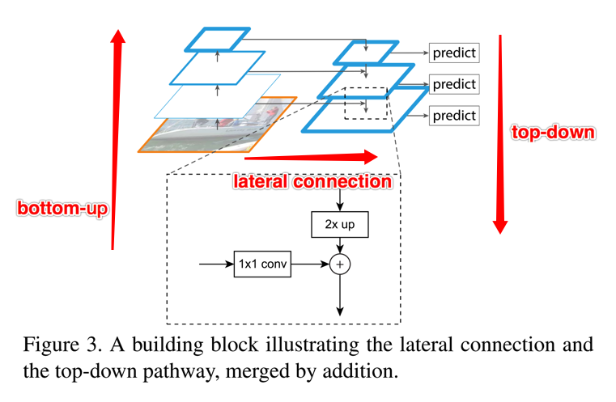

paper: [Feature Pyramid Networks for Object Detection](http://openaccess.thecvf.com/content_cvpr_2017/papers/Lin_Feature_Pyramid_Networks_CVPR_2017_paper.pdf)

### Abstract
1. 作者的出发点很简单，就是为了将多尺度引入到网络中，同时引入多余的资源占用问题
    * 下图是对比多个不同的pyramidal hierarchy的结构
        * 
    * 通过上图能看到，featurized image pyramid是对图像多尺度处理，训练时会很耗时，pramidal feature hierarchy（如ssd）则是选取不同的特征用以预测，但是如果选取的层比较靠后，会对小目标的检测有影响

2. 对比现有的多种不同的多尺度的网络结构，FPN的关键不同在于：
    * 将top-down的网络层和bottom-up的结构通过lateral connection连接起来，同时，每一个尺度下连接后的特征都会用来做预测
    * 至于bottom-up，本身就是Conv的正常的前向过程
    * top-down结构在ECCV16年的一篇文章中已提出（也是Facebook的，[Learning to Refine Object Segments][Learning to Refine Object Segments]），不同之处在于，那篇文章是最终只是用的最后的finest的层，而不像FPN对每一层都有一个预测

3. FPN对小目标的效果明显提升了，参考下图
    * 

### Details
1. 如何保持多尺度以及如何将lateral connection如何进行？
    * 首先参考图例：
    * lateral connection，相当于三个操作
        * 对被选中的bottom-up的某一层执行1\*1卷积，该操作可以实现对channel的更改
        * 对与该层对应的top-down的上一层采用一个Upsampling（作者用最近邻的方式）将fm从上一层扩增2倍到当前层（主要为了和横向过来的层保持尺度的统一方便merge）
        * 将刚才两个操作后的特征，通过element-wise的addition方式merge到一起
    * 多尺度，作者对每一层都去获取一个prediction的结果，而在prediction之前，先对merged feature map执行一个3\*3的卷积操作（作者给出的理由是通过这个操作来减少upsampling操作的混叠效应，可以理解使得最终的特征更鲁棒）
    * 作者采用的所有pyramid level都是使用256个channel

2. 如何和RPN结合？
    * 作者用FPN替换RPN的输入特征层，即对上述的每一个merged feature map后添加一个跟着两个1\*1卷积的3\*3的conv（文中表述为network head）
    * 同时，因为FPN本身已经实现来多尺度，所以在每一个merged feature map层设置anchor的scale统一，只保留不同的长宽比
    * 同时，多个level的head参数共享，作者实验表明共享与否对accuracy影响不大，原因应该就在于不同尺度的merged fm已经足够具有表达能力

3. 不足之处
    * 按文中所述，在GPU上，FPN也就5fps，这个速度还是有点低的，应该主要还是在于two-stage的检测的通病吧

---

[Learning to Refine Object Segments]: https://arxiv.org/abs/1603.08695