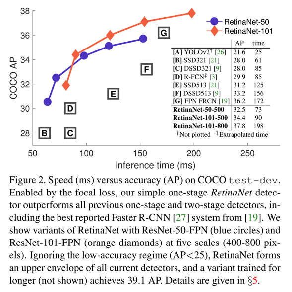
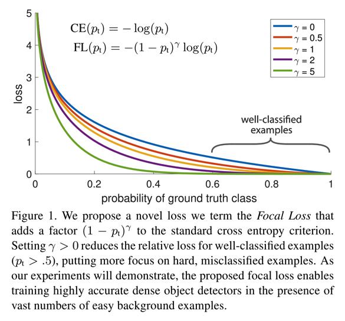
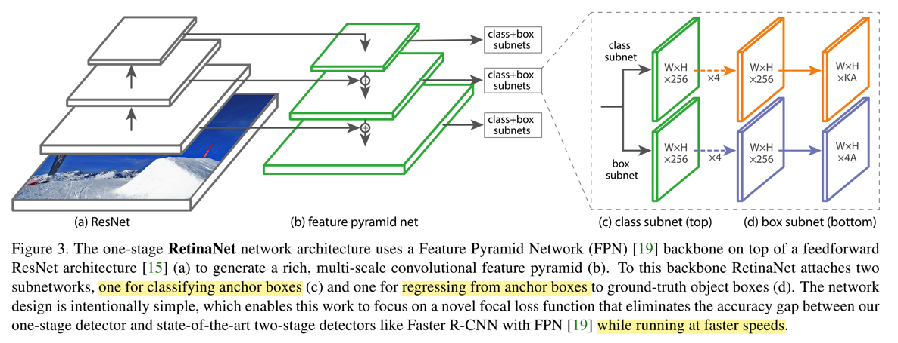

paper: [Focal Loss for Dense Object Detection](http://openaccess.thecvf.com/content_ICCV_2017/papers/Lin_Focal_Loss_for_ICCV_2017_paper.pdf)

### Abstract
1. 目前主流的目标检测方法，one-stage相较于two-stage的一个痛点就是样本分布的不平衡（目标和背景），导致one-stage虽然速度上有优势，但是精度却有所降低。因此，本文作者改写了传统的cross-entropy loss，分别增加了平衡正负样本的权重系数和平衡难易样本的系数，形成最终的focal loss。
2. 同时，本文结合ResNet、FPN、FCN搭建了one-stage的RetinaNet，并用Focal Loss训练之，使得AP和Speed均明显提升。
    * 如图: 

### Details
1. Focal Loss
    * 目标检测中，样本主要包括前景（各类检测目标）和背景，其中背景的占比较多，导致类别不平衡，影响训练效果；再者，由于不同样本在训练过程中会有难易之分，即有些样本会很容易被分类（对应的置信度得分较高），有些样本则比较难（对应的置信度得分有限），如果在训练过程中同等对待，到整个训练的loss会被easy example占据太多，收敛效果有限
    * cross-entropy loss
        * 
        * 后续公式，以只有一个样本为例
    * 针对第一点，作者在原来的二分类的cross-entropy loss上增加了alpha权重因子。即对正样本的loss增加alpha的权重，负样本的loss增加1-alpha的权重，论文实验的alpha=0.25，公式如下
        * 
        * alpha-balanced cross entropy loss是为了能够调整少量样本的权重。相对于gamma，这个参数更为稳定，但是也需要根据gamma进行一定的调整，文中最好的0.25，应该是正负样本的比例`1:3`的体现吧，这个比例可能也和真实的样本分布更吻合
    * 针对第二点，对分类的预测概率增加影响因子gamma，论文实验的gamma=2
        * 
        * 若对应目标样本，属于背景，则预测的概率P会很小，所以otherwise那一项也会很小
    * 与OHEM策略相比，focal loss效果会更好，文中也有实验表明；可能是因为，OHEM在筛选样本时，是按照置loss进行排序，只筛选topk个，也就是easy example会全部丢弃掉
    * FL的效果展示
        * 

2. anchor标签
    * RetinaNet中，对ancher的标签是one-hot的格式，即对于某个ancher，属于第i类，这K维度分类标签中，第i维为1，其他全部为0
    * anchor的标签方式和RPN很像，根据IoU比值进行匹配，与gt的IoU大于0.5认为是目标，小于0.4认为是背景，0.4到0.5之间的全部ignore
    * 每个anchor最多只能和一个gt匹配，而一个gt则可能对应了多个anchor

3. RetinaNet
    * RetinaNet的backbone网络是ResNet，再加上FPN，然后在FPN的每一个pyramid level之后添加两个FCN构成subnet，一个用于分类，一个用于回归，两者直接架构是一样的，但是参数不共享；框架如下：
        * 
    * 分类的子网络，输入channel为C的FM，使用C个3\*3的filter，每个后面接一个ReLU，然后再接KA个3\*3的卷积，得到KA个W\*H的FM，最后用sigmoid得到结果，相当于最后得到W\*H的FM中，每个点的每个anchor的二进制分类（K代表类别数，A代表anchor个数）
    * bbox回归的子网络，结构和上述的子网络一样，只是输出改为4A了

4. Trick
    * 网络初始化时，引入一个先验（属于前景的概率）。因为前景的比例较少，在训练初期背景的loss容易占据主要部分；因此作者实验中，所有新增加的层（除了Retinal的subnet的最后一层）都按照bias=0、方差为0.01的高斯核初始化，而最后一层则使用bias=-log((1-pi)/pi)的方式初始化，其中pi为0.01，通过这种方式能够使得训练更加稳定
